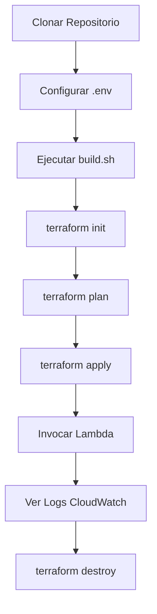

## Estructura del Proyecto

```
aws-terraform-fastlabs/
├── index.js                 # Lambda handler con logging estructurado
├── build.sh                 # Script de empaquetado con validación
├── load-credentials.sh      # Helper para cargar credenciales AWS
├── main.tf                  # Infraestructura principal (IAM + Lambda)
├── variables.tf             # Variables parametrizadas
├── outputs.tf               # Outputs para testing
├── versions.tf              # Versiones de Terraform y providers
├── .env.example             # Plantilla de credenciales
├── .gitignore               # Archivos ignorados por Git
├── package.json             # Metadata del proyecto Node.js
├── README.md                # Documentación principal
├── CONTRIBUTING.md          # Guía de contribución
├── CHANGELOG.md             # Historial de cambios
└── LICENSE                  # Licencia MIT
```

## Flujo de Trabajo



## Recursos AWS Creados

| Recurso | Tipo | Propósito |
|---------|------|-----------|
| `random_id.suffix` | Random | Sufijo único para nombres |
| `aws_iam_role.lambda_role` | IAM Role | Identidad para Lambda |
| `aws_iam_role_policy_attachment.lambda_logs` | IAM | Permisos CloudWatch |
| `aws_lambda_function.main` | Lambda | Función serverless |
| Log Group (automático) | CloudWatch | Almacena logs |

## Costos Estimados

**Uso típico para aprendizaje (100 invocaciones/mes):**

- **Lambda**: ~$0.00 (dentro del Free Tier)
  - 100 requests × 128 MB × 50ms = ~0.000625 GB-seconds
  - Free Tier: 400,000 GB-seconds/mes
  
- **CloudWatch Logs**: ~$0.00 (dentro del Free Tier)
  - ~10 KB por invocación = 1 MB total
  - Free Tier: 5 GB ingestion/mes

**Total mensual estimado**: $0.00 (dentro de Free Tier)

⚠️ **Importante**: Ejecuta `terraform destroy` después de cada sesión de aprendizaje para evitar costos innecesarios.

## Arquitectura Detallada

```
┌─────────────────────────────────────────────────────────────┐
│                        AWS Account                          │
│                                                             │
│  ┌───────────────┐                                         │
│  │   IAM Role    │                                         │
│  │  (Terraform)  │                                         │
│  │               │                                         │
│  │  Trust Policy │◄────────┐                              │
│  │  + Managed    │         │                              │
│  │    Policy     │         │ AssumeRole                   │
│  └───────────────┘         │                              │
│         │                  │                              │
│         │ Permissions      │                              │
│         ▼                  │                              │
│  ┌───────────────┐         │                              │
│  │    Lambda     │─────────┘                              │
│  │  Function     │                                         │
│  │               │                                         │
│  │  - Node.js    │                                         │
│  │  - 128 MB     │                                         │
│  │  - 10s timeout│                                         │
│  └───────────────┘                                         │
│         │                                                  │
│         │ console.log()                                    │
│         ▼                                                  │
│  ┌───────────────┐                                         │
│  │  CloudWatch   │                                         │
│  │   Logs        │                                         │
│  │               │                                         │
│  │  Log Group:   │                                         │
│  │  /aws/lambda/ │                                         │
│  │  fastlabs-... │                                         │
│  └───────────────┘                                         │
│                                                             │
└─────────────────────────────────────────────────────────────┘
         ▲
         │ aws lambda invoke
         │
    ┌────────────┐
    │   Local    │
    │   Machine  │
    │            │
    │  AWS CLI   │
    │  Terraform │
    └────────────┘
```

## Variables de Terraform

| Variable | Tipo | Default | Descripción |
|----------|------|---------|-------------|
| `aws_region` | string | `us-east-1` | Región de AWS |
| `lambda_function_name` | string | `fastlabs-hello-lambda` | Nombre de la función |
| `lambda_runtime` | string | `nodejs20.x` | Runtime de Node.js |
| `lambda_timeout` | number | `10` | Timeout en segundos |
| `lambda_memory_size` | number | `128` | Memoria en MB |

## Outputs de Terraform

| Output | Descripción | Uso |
|--------|-------------|-----|
| `lambda_function_arn` | ARN completo de la Lambda | Referencias en otras configs |
| `lambda_function_name` | Nombre de la función | AWS CLI commands |
| `lambda_role_arn` | ARN del IAM role | Auditoría de permisos |
| `lambda_role_name` | Nombre del role con suffix | Identificación en console |
| `cloudwatch_log_group_name` | Nombre del Log Group | Queries de logs |

## Ejemplos de Uso Avanzado

### Invocar con diferentes payloads

```bash
# Payload simple
aws lambda invoke \
  --function-name $(terraform output -raw lambda_function_name) \
  --cli-binary-format raw-in-base64-out \
  --payload '{"message":"Hello World"}' \
  response.json

# Payload complejo con arrays
aws lambda invoke \
  --function-name $(terraform output -raw lambda_function_name) \
  --cli-binary-format raw-in-base64-out \
  --payload '{"items":["a","b","c"],"count":3}' \
  response.json

# Desde archivo
echo '{"data":"from file"}' > payload.json
aws lambda invoke \
  --function-name $(terraform output -raw lambda_function_name) \
  --cli-binary-format raw-in-base64-out \
  --payload file://payload.json \
  response.json
```

### Queries de CloudWatch Logs Insights

```bash
# Filtrar logs por campo específico
aws logs filter-log-events \
  --log-group-name $(terraform output -raw cloudwatch_log_group_name) \
  --filter-pattern '{ $.testType = "synchronous" }'

# Ver solo errores (si los hubiera)
aws logs filter-log-events \
  --log-group-name $(terraform output -raw cloudwatch_log_group_name) \
  --filter-pattern "ERROR"

# Estadísticas de duración
aws logs start-query \
  --log-group-name $(terraform output -raw cloudwatch_log_group_name) \
  --start-time $(date -u -d '1 hour ago' +%s) \
  --end-time $(date -u +%s) \
  --query-string 'fields @timestamp, @duration | stats avg(@duration), max(@duration), min(@duration)'
```

### Monitoreo en tiempo real con múltiples invocaciones

```bash
# Terminal 1: Logs en tiempo real
aws logs tail $(terraform output -raw cloudwatch_log_group_name) --follow --format short

# Terminal 2: Script de carga
for i in {1..10}; do
  aws lambda invoke \
    --function-name $(terraform output -raw lambda_function_name) \
    --cli-binary-format raw-in-base64-out \
    --payload "{\"iteration\":$i,\"timestamp\":\"$(date -u +%Y-%m-%dT%H:%M:%SZ)\"}" \
    response-$i.json
  sleep 1
done
```

## Extensiones Sugeridas

Una vez domines este proyecto base, considera agregar:

1. **API Gateway**: Exponer Lambda vía HTTP
   ```terraform
   resource "aws_api_gateway_rest_api" "api" {
     name = "lambda-api"
   }
   ```

2. **DynamoDB**: Persistencia de datos
   ```terraform
   resource "aws_dynamodb_table" "data" {
     name = "lambda-data"
     billing_mode = "PAY_PER_REQUEST"
     hash_key = "id"
   }
   ```

3. **EventBridge**: Triggers programados
   ```terraform
   resource "aws_cloudwatch_event_rule" "every_hour" {
     schedule_expression = "rate(1 hour)"
   }
   ```

4. **X-Ray**: Tracing distribuido
   ```terraform
   resource "aws_lambda_function" "main" {
     # ...
     tracing_config {
       mode = "Active"
     }
   }
   ```

5. **Dead Letter Queue**: Manejo de errores
   ```terraform
   resource "aws_sqs_queue" "dlq" {
     name = "lambda-dlq"
   }
   ```

## Seguridad y Mejores Prácticas

### ✅ Implementado en este proyecto:
- ✅ Principio de least privilege (solo permisos necesarios)
- ✅ Credenciales nunca en Git (.gitignore)
- ✅ Tags para tracking y organización
- ✅ Managed policies (actualizaciones automáticas)
- ✅ Random suffix en nombres (evita colisiones)
- ✅ Logging estructurado (auditoría)

### 🔒 Recomendaciones adicionales:
- Rotar Access Keys cada 90 días
- Usar AWS IAM Identity Center (SSO) para producción
- Habilitar MFA en cuenta AWS
- Revisar AWS Config para compliance
- Configurar AWS CloudTrail para auditoría
- Usar AWS Secrets Manager para secretos
- Implementar resource policies restrictivas

## Recursos de Aprendizaje

### Documentación Oficial
- [AWS Lambda Developer Guide](https://docs.aws.amazon.com/lambda/latest/dg/welcome.html)
- [Terraform AWS Provider](https://registry.terraform.io/providers/hashicorp/aws/latest/docs)
- [CloudWatch Logs](https://docs.aws.amazon.com/AmazonCloudWatch/latest/logs/WhatIsCloudWatchLogs.html)

### Tutoriales Relacionados
- [AWS Lambda Best Practices](https://docs.aws.amazon.com/lambda/latest/dg/best-practices.html)
- [Terraform Best Practices](https://www.terraform-best-practices.com/)
- [Node.js on AWS Lambda](https://docs.aws.amazon.com/lambda/latest/dg/lambda-nodejs.html)

### Comunidad
- [AWS Community Builders](https://aws.amazon.com/developer/community/community-builders/)
- [Terraform Community](https://discuss.hashicorp.com/c/terraform-core/27)
- [r/aws subreddit](https://www.reddit.com/r/aws/)

## FAQ

**P: ¿Puedo usar otra región que no sea us-east-1?**  
R: Sí, modifica la variable `aws_region` en `variables.tf` o pasa `-var="aws_region=us-west-2"` al hacer terraform apply.

**P: ¿Cómo agrego dependencias npm a la Lambda?**  
R: Crea `package.json` con tus dependencias, ejecuta `npm install`, y modifica `build.sh` para incluir `node_modules/` en el ZIP.

**P: ¿Puedo usar este proyecto en producción?**  
R: Es un proyecto educativo. Para producción agrega: monitoring, alarmas, DLQ, multi-región, CI/CD, tests, y secrets management.

**P: ¿Cómo debugging local antes de deploy?**  
R: Usa [AWS SAM CLI](https://docs.aws.amazon.com/serverless-application-model/latest/developerguide/serverless-sam-cli-install.html) para testing local con `sam local invoke`.

**P: ¿Puedo tener múltiples ambientes (dev/staging/prod)?**  
R: Sí, usa Terraform Workspaces o módulos separados con diferentes archivos `.tfvars`.

---

**Última actualización**: Enero 2026  
**Maintainer**: David Paredes  
**Licencia**: MIT
